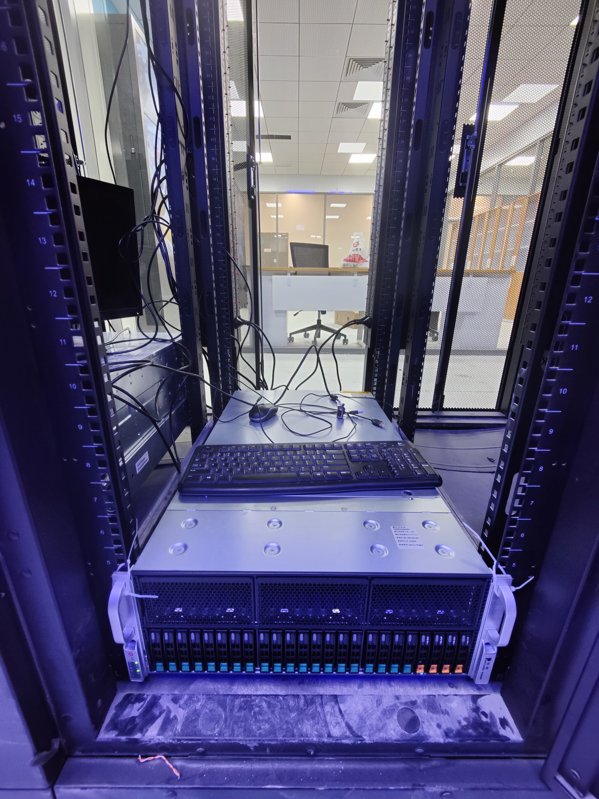
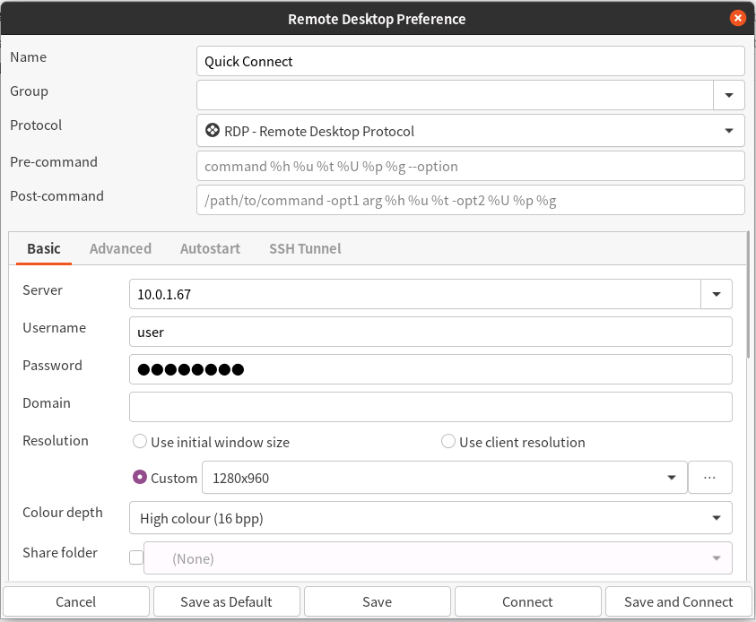
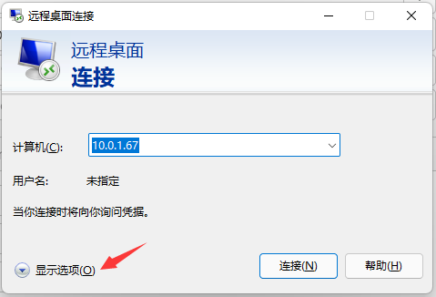

<h1 align="center">Cluster User Basics</h1>

2022-03-10 v0.1

# Introduction

Our cluster is located in `云谷校区-E6-1楼-核心机房`, currently has `1` node(s) active.

We have been designated with an IP address range: `10.0.1.66-94/27`

The specifics of the cluster nodes are as follows:

GPU Node 1：

|  Name  |  Spec  |
| :----: | :----  |
|  Model | PR4908R|
|  CPU   | AMD EPYC 7302*2 (32C/64T, 3.0GHz)|
| Memory | DDR4 256G (16G*16) 2933MHz ECC REG|
|  GPU   | NVIDIA RTX 3090 * 8 |
|  SSD   | Intel P4510 2TB * 1 |
|  SSD   | Intel S4510 1.92TB * 2 |
|*IP Address*| **10.0.1.67** |

# User Account

## Ask for your account

You need to ask system `admin` to get your user account.

## Login

You can use either SSH (Secure Shell Protocol) or RDP (Remote Desktop Protocol) to login.

## RDP

RDP provides a remote desktop interface which is more user-friendly.

First you need a RDP Client. On Windows, there is a built-in software `mstsc.exe`, or you can download a newer `Microsoft Remote Desktop` from the Microsoft Store.
On Linux, it's recommended to install Remmina and remmina-plugin-rdp.

Using the RDP Clients is simple. Following the prompts, type in the server address, user name, password, set the screen resolution and color depth you want.

## SSH

The SSH port has been set to `22332` for safety. To login by SSH, just simply run:

    ssh -p 22332 <UserName>@10.0.1.67

### Tricks on SSH

#### The Config File

You can simplify the command by writing the configuration file at `~/.ssh/config`.† Here is an example:

    Host Node1
        HostName    10.0.1.67
        User        admin
        Port        22332

Note that the indents are not mandatory.

† The symbol `~` usually stands for user home directory in *nix operating systems. However, in Windows Powershell, you can hit `Tab` after typing a path with `~`, e.g. `~/.ssh`, it will be auto-compeleted to `C:/Users/<UserName>/.ssh`.

#### Best Practice: Using SSH Certificates

TL;DR: Imagine how frustrating it is to enter your password again and again when the network connection is unstable. With an SSH certificate, you will never need to enter a password, and at the same time it provides greater security, powered by cryptography, it prevents man-in-the-middle attacks, etc.

- Step 1. On your PC, go to folder:

    mkdir ~/.ssh && cd ~/.ssh

- Step 2. Create a public/private key pair:

    ssh-keygen
    
    (And hit ENTER multiple times)

    (You can set a passphrase for the private key for advanced safety)

- Step 3. Copy the public key

    cat ~/.ssh/id_rsa.pub

    (Copy)

- Step 4. On remote Server, create and edit file, paste the public key into it:

    mkdir ~/.ssh && vim ~/.ssh/authorized_hosts

    (Paste and Save)

- Step 5. On your PC, apply the private key (On Windows, etc, you need to do this after reboots)

    ssh-agent

    ssh-add ~/.ssh/id_rsa

