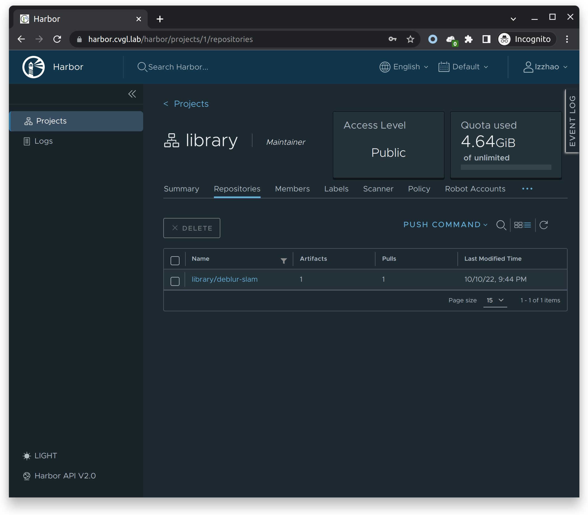

<h1 align="center">Custom Containerized Deep Learning Environment<br>
with Docker and Harbor </h1>

# For Beginners: build FROM a base image

*Determined AI* provides [*Docker* images](https://hub.docker.com/r/determinedai/environments/tags) that includes common deep-learning libraries and frameworks. You can also [develop your custom image](https://gpu.cvgl.lab/docs/prepare-environment/custom-env.html) based on your project dependency.

For beginners, it is recommended that custom images use one of the Determined AI's official images as a base image, using the `FROM` instruction.

## Example

Here is an example: Suppose you have `environment.yaml` for creating the `conda` environment, `pip_requirements.txt` for `pip` requirements and some `apt` packages that need to be installed.

> Before proceeding to build your custom Docker image, you need to [install Docker](https://docs.docker.com/engine/install/), or you can choose the *easier* way: build it on the **login-node**.

Put these files in a folder, and create a `Dockerfile` with the following contents:

```Dockerfile
# Determined Image
FROM determinedai/environments:cuda-11.3-pytorch-1.10-tf-2.8-gpu-0.19.4
# Some important environment variables in Dockerfile
ARG DEBIAN_FRONTEND=noninteractive
ENV TZ=Asia/Shanghai LANG=C.UTF-8 LC_ALL=C.UTF-8 PIP_NO_CACHE_DIR=1

# Custom Configuration
RUN sed -i  "s/archive.ubuntu.com/mirrors.ustc.edu.cn/g" /etc/apt/sources.list && \
    sed -i  "s/security.ubuntu.com/mirrors.ustc.edu.cn/g" /etc/apt/sources.list && \
    rm -f /etc/apt/sources.list.d/* && \
    apt-get update && \
    apt-get -y install tzdata && \
    apt-get install -y unzip python-opencv graphviz
COPY environment.yml /tmp/environment.yml
COPY pip_requirements.txt /tmp/pip_requirements.txt
RUN conda env update --name base --file /tmp/environment.yml
RUN conda clean --all --force-pkgs-dirs --yes
RUN eval "$(conda shell.bash hook)" && \
    conda activate base && \
    pip config set global.index-url https://mirrors.bfsu.edu.cn/pypi/web/simple &&\
    pip install --requirement /tmp/pip_requirements.txt
```

Here are some other examples:

[svox2](./Example_Envs/svox2/)

[lietorch-opencv](./Example_Envs/lietorch-opencv/)

Notice that we are using the `apt` mirror by `ustc.edu.cn` and the `pip` mirror by `bfsu.edu.cn`. They are currently fast and thus recommended by the system admin.

To build the image, use the following command:

```bash
DOCKER_BUILDKIT=0 docker build -t my_image:v1.0 .
```

where `my_image` is your image name, and `v1.0` is the image tag that usually contains descriptions and version information. `DOCKER_BUILDKIT=0` is needed if you are using private Docker registry (i.e. our Harbor) [[Reference]](https://stackoverflow.com/questions/75766469/docker-build-cannot-pull-base-image-from-private-docker-registry-that-requires).

Don't forget the dot "." at the end of the command!

If the Dockerfile building process needs international internet access, you can add build arguments to use the public proxy services:

```bash
DOCKER_BUILDKIT=0 docker build -t my_image:v1.0 --build-arg http_proxy=http://10.0.1.68:8889 --build-arg https_proxy=http://10.0.1.68:8889 .
```

The status of our public proxies can be monitored here: [Grafana - v2ray-dashboard](https://grafana.cvgl.lab/d/CCSvIIEZz/v2ray-dashboard)

The pulling stage will take about half an hour or longer for the first time. We will discuss how to accelerate this process in the [next section](#accelerating-the-pulling-stage).

# Accelerating the pulling stage

Instead of pulling determinedai's images from Docker Hub, you can pull them from our Harbor registry.

Check out [here](https://harbor.cvgl.lab/harbor/projects/2/repositories/environments/) to see the available images. You can also ask the system admin to add or update the images.

To use our Harbor registry, you need to complete the following setup:

```bash
sudo mkdir -p /etc/docker/certs.d/harbor.cvgl.lab
cd /etc/docker/certs.d/harbor.cvgl.lab
sudo wget https://cvgl.lab/cvgl.crt --no-check-certificate
sudo systemctl restart docker
```

This configures the CA certificate for Docker.

Then log in to our Harbor registry:

```bash
docker login -u <username> -p <password> harbor.cvgl.lab    # You only need to login once
```

Now edit the first `FROM` line in the `Dockerfile`, and change the base image to some existing image in the Harbor registry, for example:

```dockerfile
FROM harbor.cvgl.lab/determinedai/environments:cuda-11.3-pytorch-1.10-lightning-1.5-tf-2.8-gpu-0.18.5
```

# Upload the custom image

Instead of pushing the image to Docker Hub (which will be very slow because of the GFW), it is recommended to use the private Harbor registry: `harbor.cvgl.lab`.

You need to ask the system admin to create your Harbor user account. Once you have logged in, you can check out the [public library](https://harbor.cvgl.lab/harbor/projects/1/repositories):



Note that instead of using the default `library`, you can also create your own *project* in Harbor.

Make sure you have configured your `hosts` file with the following settings:

```text
10.0.1.68 cvgl.lab
10.0.1.68 harbor.cvgl.lab
```

Also, you need to complete the CA certificate configuration in the [previous section](#accelerating-the-pulling-stage).

Now you can create your custom Docker images on the login node or your PC following the instructions above, and then push the image to the Harbor registry. For instance:

```bash
docker login -u <username> -p <password> harbor.cvgl.lab    # You only need to login once
docker tag my_image:v1.0  harbor.cvgl.lab/library/my_image:v1.0
docker push harbor.cvgl.lab/library/my_image:v1.0
```

In the first line, replace `<username>` with your username and `<password>` with your password.

In the second line, add the prefix `harbor.cvgl.lab/library/` to your image. Don't worry, this process does not occupy additional storage.

In the third line, push your new tagged image.

# Use the custom image

In the Determined AI configuration `.yaml` file (as mentioned in [the previous tutorial](./Determined_AI_User_Guide.md#task-configuration-template)), use the newly tagged image (like `harbor.cvgl.lab/library/my_image:v1.0` above) to tell the system to use your new image as the task environment.

Also note that every time you update an image, you need to change the image name, otherwise the system will not be able to detect the image update (probably because it only uses the image name as detection, not its checksum).

# Advanced: build an image from scratch

To make our life easier, we will build our custom image FROM NVIDIA's base image. You can use the minimum template we provide: [determined-minimum](./Example_Envs/determined-minimum/)

Note that for RTX 4090, we need `CUDA` version >= `11.8`, thus you need to use the base image from [NGC/CUDA](https://catalog.ngc.nvidia.com/orgs/nvidia/containers/cuda) with tags >= 11.8, or [NGC/Pytorch](https://catalog.ngc.nvidia.com/orgs/nvidia/containers/pytorch) with tags >= 22.09.

Here are some examples tested on RTX 4090:

1. nerf-env [[Dockerfile]](./Example_Envs/nerf-env/) [[Harbor]](https://harbor.cvgl.lab/harbor/projects/1/repositories/nerf_env_test/artifacts-tab/artifacts/sha256:fd1376632bd15ea92eb9791723e95fab833f4f30185a9a8c3f765d158713bc60)

2. torch-ngp [[Dockerfile]](./Example_Envs/torch-ngp/) [[Harbor]](https://harbor.cvgl.lab/harbor/projects/1/repositories/zlz-torch-ngp/artifacts-tab/artifacts/sha256:a5e1d1d87123910bb904426e921c1857d401c73e5789c56600fac1039dd4d024)

3. taichi-nerf-slam [[Dockerfile]](./Example_Envs/taichi-nerf-slam/) [[Harbor]](https://harbor.cvgl.lab/harbor/projects/1/repositories/zlz-taichi-nerf-slam/artifacts-tab/artifacts/sha256:4a6f9395008187921dfe4370164c18e7b000fbff56969a997d950aca43aaa702)

4. nerfstudio & sdfstudio [[Dockerfile]](./Example_Envs/nerfstudio/) [[Harbor - nerfstudio]](https://harbor.cvgl.lab/harbor/projects/1/repositories/zlz-nerfstudio/artifacts-tab/artifacts/sha256:4dd0c7316f30127e83a79467bd88b4984bbab1ee63762102b3cef1f9c7c006be) [[Harbor - sdfstudio]](https://harbor.cvgl.lab/harbor/projects/1/repositories/zlz-sdfstudio/artifacts-tab/artifacts/sha256:f4515c1c9bece35e689ada0f143fea88e11dbc0c0fe76ec412013661e83b2f1b)
