<h1 align="center">Getting started with the batch system:<br>
Determined-AI User Guide </h1>

- [Introduction](#introduction)
- [User Account](#user-account)
  - [Ask for your account](#ask-for-your-account)
  - [Authentication](#authentication)
    - [WebUI](#webui)
    - [CLI](#cli)
  - [Changing passwords](#changing-passwords)
- [Submitting Tasks](#submitting-tasks)
  - [Task Configuration Template](#task-configuration-template)
  - [Submit via Web UI](#submit-via-web-ui)
  - [Submit via CLI](#submit-via-cli)
  - [Managing Tasks](#managing-tasks)
  - [Connect to a shell task](#connect-to-a-shell-task)
    - [First-time setup of connecting VS Code to a shell task](#first-time-setup-of-connecting-vs-code-to-a-shell-task)
    - [Update the setup of connecting VS Code to a shell task](#update-the-setup-of-connecting-vs-code-to-a-shell-task)
  - [Experiments](#experiments)
  - [References](#references)

# Introduction


We are currently using [Determined AI](https://www.determined.ai/) to manage our GPU Cluster.

You can open the dashboard (a.k.a WebUI) by the following URL and log in:

[https://gpu.cvgl.lab/](https://gpu.cvgl.lab/)

Determined is a successful (acquired by Hewlett Packard Enterprise in 2021) open-source deep learning training platform that helps researchers train models more quickly, easily share GPU resources, and collaborate more effectively. [1](https://developer.hpe.com/blog/deep-learning-model-training-%E2%80%93-a-first-time-user%E2%80%99s-experience-with-determined-part-1/)

Its architecture is shown below:

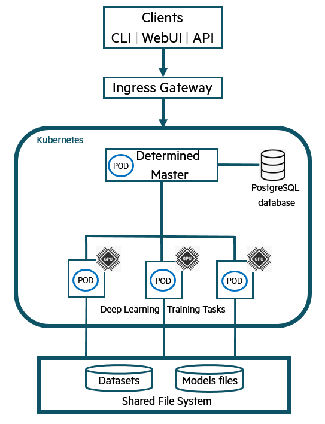

# User Account

## Ask for your account

You need to ask the system `admin` to get your user account. 

## Authentication

### WebUI

The WebUI will automatically redirect users to a login page if there is no valid Determined session established on that browser. After logging in, the user will be redirected to the URL they initially attempted to access.

### CLI

Users can also interact with Determined using a command-line interface (CLI). The CLI is distributed as a Python wheel package; once the wheel has been installed, the CLI can be used via the `det` command.

You can use the CLI either on the login node or on your local development machine.

1) Installation

    The CLI can be installed via pip:

    > Note that determined>=0.18.0 does not show the port number when using command `det shell show_ssh_command`, though this works well with ssh, Visual Studio Code etc., but PyCharm must have this port number. If you uses PyCharm and want to use its remote development on the cluster, you should use version 0.17.x.

    ```bash
    pip install determined==0.17.15
    ```

2) Configure environment variable

    If you are using your own PC, you need to add the environment variable `DET_MASTER=10.0.1.66`.

    For Linux, *nix including macOS, if you are using `bash` append this line to the end of `~/.bashrc` (most systems) or `~/.bash_profile` (some macOS);

    If you are using `zsh`, append it to the end of `~/.zshrc`:

    ```bash
    export DET_MASTER=10.0.1.66
    ```

    For Windows, you can follow this tutorial: [tutorial](https://www.architectryan.com/2018/08/31/how-to-change-environment-variables-on-windows-10/)

3) Log in

    In the CLI, the user login subcommand can be used to authenticate a user:

    ```bash
    det user login <username>
    ```

    Note: If you did not configure the environment variable, you need to specify the master's IP:

    ```bash
    det -m 10.0.1.66 user login <username>
    ```

## Changing passwords

Users have *blank* passwords by default. If desired, a user can change their own password using the user change-password subcommand:

```bash
det user change-password
```

# Submitting Tasks

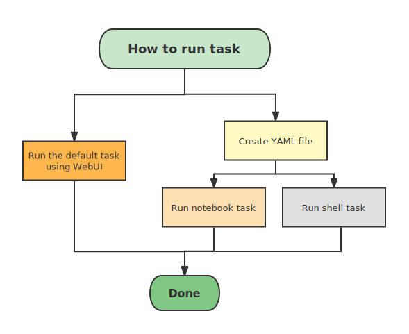

## Task Configuration Template

Here is a template of a task configuration file, in YAML format:

```yaml
description: <task_name>
resources:
    slots: 1
bind_mounts:
    - host_path: /workspace/<user_name>/
      container_path: /run/determined/workdir/home/
    - host_path: /datasets/
      container_path: /run/determined/workdir/data/
environment:
    image: determinedai/environments:cuda-11.3-pytorch-1.10-lightning-1.5-tf-2.8-deepspeed-0.5.10-gpu-0.18.2
```

Notes:

- You need to change the `task_name` and `user_name` to your own
- Number of `resources.slots` is the number of GPUs you want to use, which is set to `1` here
- In `bind_mounts`, the first host_path/container_path maps your workspace directory into the container; And the second maps the dataset directory (`/datasets`) into the container.
- In `environment.image`, an official image by *Determined AI* is used. *Determined AI* provides [*Docker* images](https://hub.docker.com/r/determinedai/environments/tags) that include common deep-learning libraries and frameworks. You can also [develop your custom image](https://gpu.cvgl.lab/docs/prepare-environment/custom-env.html) based on your project dependency, which will be discussed in this tutorial: [Custom Containerized Environment](./Custom_Containerized_Environment)
- How `bind_mounts` works:


## Submit via Web UI

Click "Launch JupyterLab" in the upper left corner of the Determined Web UI:

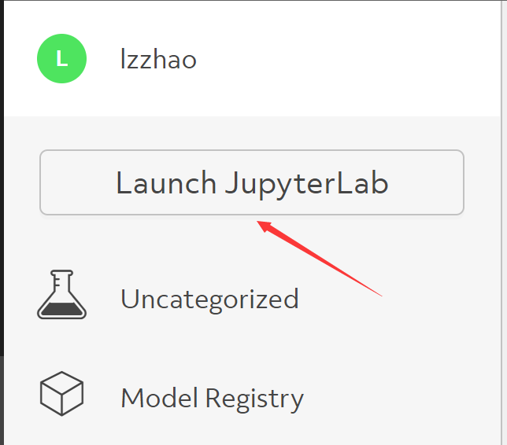

When the sidebar is collapsed the button becomes like this:

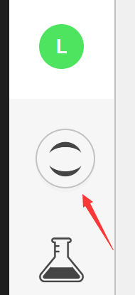

In the popped out dialog window, select **show full config**:

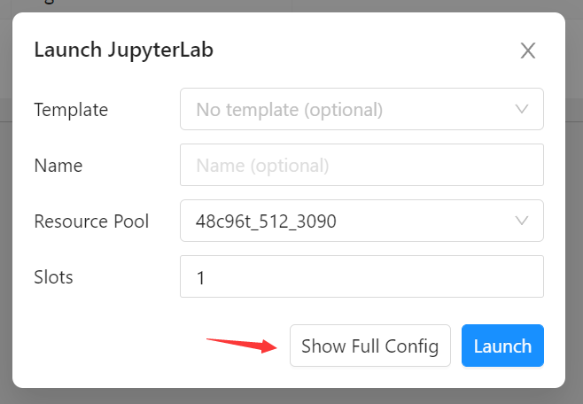

Then enter your YAML configuration and hit **Launch**!

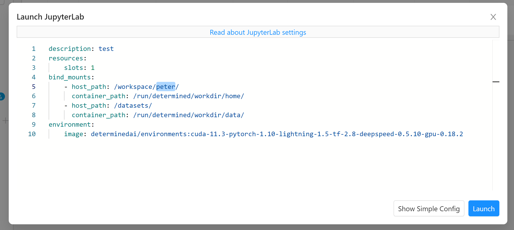

## Submit via CLI

Save the YAML configuration to, let's say, `test_task.yaml`. You can start a Jupyter Notebook (Lab) environment or a simple shell environment. A notebook is a web interface and thus more user-friendly. However, you can use **Visual Studio Code** or **PyCharm** and connect to a shell environment[[3]](https://gpu.cvgl.lab/docs/interfaces/ide-integration.html), which brings more flexibility and productivity if you are familiar with these editors.

For notebook:

```bash
    det notebook start --config-file test_task.yaml
```

For shell:

```bash
    det shell start --config-file test_task.yaml
```

Now you can see your task pending/running on the WebUI dashboard.


## Managing Tasks

You can manage the tasks on the WebUI.


You are encouraged to check out more operations of Determined.AI in the [API docs](https://gpu.cvgl.lab/docs/interfaces/commands-and-shells.html), e.g., 
* `det task`
* `det shell open [task id]`
* `det shell kill [task id]`

## Connect to a shell task

You can use **Visual Studio Code** or **PyCharm** to connect to a shell task.

### First-time setup of connecting VS Code to a shell task

1. First, you need to install the [Remote-SSH](https://code.visualstudio.com/docs/remote/ssh) plugin.

2. Check the UUID of your tasks:

    ```bash
    det shell list
    ```

3. Get the ssh command for the task with the UUID above (it also generates an SSH IdentityFile on your PC):

    ```bash
    det shell show_ssh_command <UUID>
    ```

4. Add the shell task as a new SSH task:

    Click the SSH button on the left-bottom corner:

    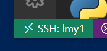

    Select connect to host -> +Add New SSH Host:

    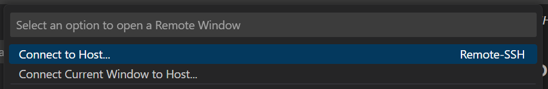

    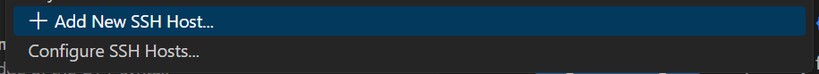

    Paste the SSH command generated by `det shell show_ssh_command` above in to the dialog window:

    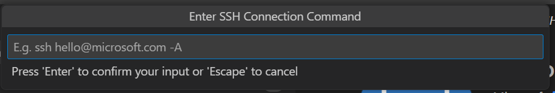

    Then choose your ssh configuration file to update:

    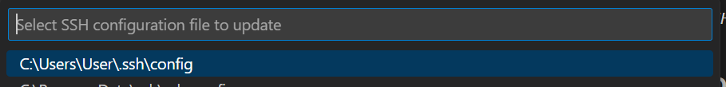

    You can continue to edit your ssh configuration file, e.g. add a custom name:

    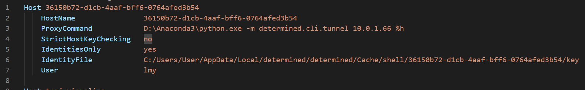
    
    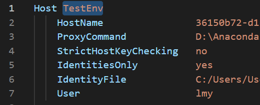

### Update the setup of connecting VS Code to a shell task

1. Check the UUID of your tasks:

    ```bash
    det shell list
    ```

2. Get the new ssh command:

    ```bash
    det shell show_ssh_command <UUID>
    ```

3. Replace the old UUID with the new one (with `Ctrl + H`):

    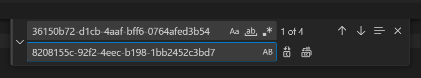

## Experiments

(TODO)


## References

[[1]](https://gpu.cvgl.lab/docs/sysadmin-basics/users.html)
[[2]](https://zhuanlan.zhihu.com/p/422462131)
[[3]](https://gpu.cvgl.lab/docs/interfaces/ide-integration.html)