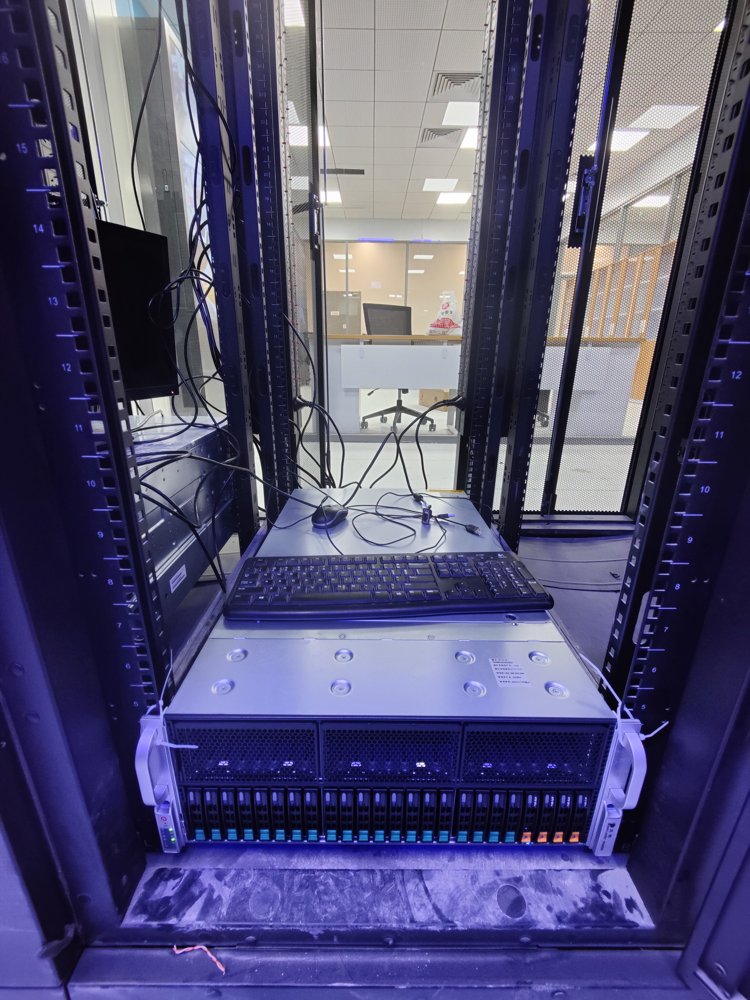

# Welcome to the Wiki.

## Introduction

Our cluster is located at the core server room, ground floor of building E6, Yungu Campus (云谷校区-E6-1楼-核心机房), currently has `1` node(s) active.

We have been designated with an IP address range: `10.0.1.66-94/27`

The specifics of the cluster nodes are as follows:

GPU Node 1：

|  Name  |  Spec  |
| :----: | :----  |
|  Model | PR4908R|
|  CPU   | AMD EPYC 7302*2 (32C/64T, 3.0GHz)|
| Memory | DDR4 256G (16G*16) 2933MHz ECC REG|
|  GPU   | NVIDIA RTX 3090 * 8 |
|  SSD   | Intel P4510 2TB * 1 |
|  SSD   | Intel S4510 1.92TB * 2 |
|*IP Address*| **10.0.1.67** |

 Click to show photo 

## Quick guide

[Tutorials Overview](https://git.cvgl.lab/Cluster_User_Group/cluster-user-guide/wiki/Tutorials)

[Getting Started](https://git.cvgl.lab/Cluster_User_Group/cluster-user-guide/wiki/Getting_started)

[Determined-AI User Guide](https://git.cvgl.lab/Cluster_User_Group/cluster-user-guide/wiki/Determined_AI_User_Guide)
