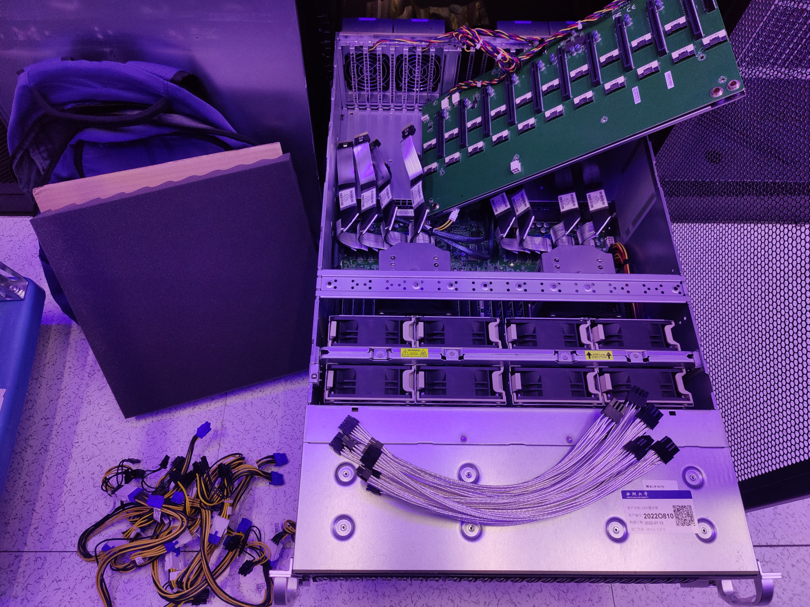

# Welcome to the Wiki.

## Quick guide

[1. Getting Started](./Getting_started.md)

[2. Determined-AI User Guide](./Determined_AI_User_Guide.md)

[3. Custom Containerized Environment](./Custom_Containerized_Environment.md)

## Introduction

Currently, we are hosting these services (available after [configuring the `hosts`](./Getting_started.md#user-content-setting-up-the-hosts-file)):

[CVGL homepage](https://cvgl.lab/)

[Determined AI - Distributed Deep Learning and Hyperparameter Tuning Platform](https://gpu.cvgl.lab/)

[Nextcloud - File storage and sharing](https://pan.cvgl.lab/)

[Harbor - Container registry for GPU cluster](https://harbor.cvgl.lab/)

[Grafana - Statistics and visualization](https://grafana.cvgl.lab/)

[FRP - Port forwarding](https://frp.cvgl.lab/)

[Wandb local - Self-hosted weights & biases](https://wandb.cvgl.lab/)

Shared Folders:

https://pan.cvgl.lab/s/6P8EyrewEz4G3sm

## Cluster Information

Our cluster is located in the core server room, E6-106; currently has `7` GPU nodes, `1` storage server and `1` management server active.

We have been designated with an IP address range: `10.0.1.66-94/27`.

System Topology:

```text
┌───────────────────────────────────┐ ┌──────────────────────────────────┐
│             Login Node            │ │        NGINX Reverse Proxy       │
└─────────────┬─────────────────────┘ └────────┬────────┬────────────────┘
              │                                │        │
            Access      ┌────────Access────────┘      Access
              │         │                               │
┌─────────────▼─────────▼───────────┐ ┌─────────────────▼─────────────────┐
│     Determined AI GPU Cluster     │ │      Supplementary Services       │
├───────────────────────────────────┤ ├───────────────────────────────────┤
│                                   │ │                                   │
│ ┌──────┐ ┌────┐ ┌────┐ ┌────┐     │ │  ┌──────┐ ┌───────┐ ┌───────┐     │
│ │Master│ │GPU │ │GPU │ │GPU │     │ │  │      │ │       │ │       │     │
│ │      │ │    │ │    │ │    │ ... │ │  │Harbor│ │Grafana│ │ Other │ ... │
│ │ Node │ │Node│ │Node│ │Node│     │ │  │      │ │       │ │       │     │
│ └──────┘ └────┘ └────┘ └────┘     │ │  └──────┘ └───────┘ └───────┘     │
│                                   │ │                                   │
└───────────────────┬───────────────┘ └──────────┬────────────────────────┘
                    │                            │
                  Access                       Access
                    │                            │
┌───────────────────▼────────────────────────────▼────────────────────────┐
│                              TrueNAS - NFS                              │
├─────────────────────────────────────────────────────────────────────────┤
│                                                                         │
│                              Storage Server                             │
│                                                                         │
└─────────────────────────────────────────────────────────────────────────┘
```

The specifics of the cluster nodes are as follows:

GPU Node 1：

|  Name  |  Spec  |
| :----: | :----  |
|  Model | Powerleader PR4908R (Supermicro 4124GS-TNR)|
|  CPU   | AMD EPYC 7302 * 2 (32C/64T, 3.0-3.3GHz)|
|  RAM   | Samsung M393A2K43DB2-CVF DDR4 256G (16G*16) 2933MT/s ECC REG|
|  GPU   | MSI (0x1462) RTX 3090 Turbo * 8 |
|  SSD   | Intel P4510 2TB (U.2 PCIe 3.1) * 1 |
|  NIC   | Intel I350-T2 1GbE Dual Port|
|  NIC   | Mellanox ConnectX-4 VPI EDR QSFP28 MCX455A-ECAT 100Gb ETH/IB Single Port|
|  RAID  | LSI MegaRAID SAS-3 3108 |

GPU Node 2:

|  Name  |  Spec  |
| :----: | :----  |
|  Model | Powerleader PR4908R (Supermicro 4124GS-TNR)|
|  CPU   | AMD EPYC 7402 * 2 (48C/96T, 2.8-3.35GHz)|
|  RAM   | SK Hynix HMA84GR7DJR4N-XN DDR4 512G (32G*16) 3200MT/s ECC REG|
|  GPU   | MANLI (NVIDIA/0x10DE) RTX 4090 * 8 |
|  SSD   | Intel P4510 2TB (U.2 PCIe 3.1) * 1 |
|  SSD   | Kioxa CD6 7.68TB (U.2 PCIe 4.0) * 1 |
|  NIC   | Intel I350-T2 1GbE Dual Port|
|  NIC   | Mellanox ConnectX-4 VPI EDR QSFP28 MCX455A-ECAT 100Gb ETH/IB Single Port|

GPU Node 3, 4:

|  Name  |  Spec  |
| :----: | :----  |
|  Model | Powerleader PR4908R (Supermicro 4124GS-TNR)|
|  CPU   | AMD EPYC 7402 * 2 (48C/96T, 2.8-3.35GHz)|
|  RAM   | Samsung M393A4K40DB3-CWE DDR4 512G (32G*16) 3200MT/s ECC REG|
|  GPU   | MSI (0x1462) RTX 3090 * 8 |
|  SSD   | Intel P4510 2TB (U.2 PCIe 3.1) * 1 |
|  NIC   | Intel I350-T2 1GbE Dual Port|
|  NIC   | Mellanox ConnectX-4 VPI EDR QSFP28 MCX455A-ECAT 100Gb ETH/IB Single Port|

GPU Node 5:

|  Name  |  Spec  |
| :----: | :----  |
|  Model | ASUS ESC8000A-E11|
|  CPU   | AMD EPYC 7543 * 2 (64C/128T, 2.8-3.7GHz)|
|  RAM   | Samsung M393A4K40EB3-CWE DDR4 512G (32G*16) 3200MT/s ECC REG|
|  GPU   | MANLI (NVIDIA/0x10DE) RTX 4090 * 8 |
|  SSD   | Intel S4610 (SSDSC2KG96) 960G (SATA) (RAID 1) * 2|
|  NIC   | Intel I350-T4 1GbE Quad Port|
|  NIC   | Mellanox ConnectX-4 VPI EDR QSFP28 MCX455A-ECAT 100Gb ETH/IB Single Port|
|  RAID  | LSI SAS3008 PCI-Express Fusion-MPT SAS-3 |

GPU Node 6, 7:

|  Name  |  Spec  |
| :----: | :----  |
|  Model | ASUS ESC8000A-E12|
|  CPU   | AMD EPYC 9554 * 2 (128C/256T, 3.1-3.75GHz)|
|  RAM   | Samsung M321R8GA0BB0-CQKZJ / Micron MTC40F2046S1RC48BA1 DDR5 1536G (64G*24) 4800MT/s ECC REG|
|  GPU   | MSI (NVIDIA/0x10DE) RTX 4090 * 8 |
|  SSD   | Samsung PM9A3 1.92T (U.2 PCIe 4.0) * 1|
|  NIC   | Intel I350-AM2 1GbE Dual Port |
|  NIC   | Mellanox ConnectX-4 VPI EDR QSFP28 MCX455A-ECAT 100Gb ETH/IB Single Port|

Storage Server

|  Name  |  Spec  |
| :----: | :----  |
|  Model | Powerleader PR4224AK (Supermicro H11SSL)|
|  CPU   | AMD EPYC 7302 (16C/32T, 3.0-3.3GHz)|
|  RAM   | Samsung M393A4K40DB2-CWE DDR4 256G (32G*8) 2933MT/s ECC REG |
|  SSD   | INTEL 760p (SSDPEKKW256G8) 256G (M.2 PCIe 3.0) * 1|
|  SSD   | Intel S4510 1.92TB (SATA) * 2 |
|  SSD   | WD Ultrastar DC SN640 (WUS4BB076D7P3E3) 7.68TB (U.2 PCIe 3.0) * 4 |
|  HDD   | Seagate Exos X18 18TB * 14 |
|  NIC   | Intel i210 1GbE * 2 |
|  NIC   | Mellanox ConnectX-4 VPI EDR QSFP28 MCX455A-ECAT 100Gb ETH/IB Single Port|
|  RAID  | LSI SAS3008 PCI-Express Fusion-MPT SAS-3 |

Management Server

|  Name  |  Spec  |
| :----: | :----  |
|  Model | ASUS RS520-E9-RS8 V2 |
|  CPU   | Intel Xeon Silver 4210R * 2 (20C/40T, 2.4-3.2GHz) |
|  RAM   | Samsung M393A4K40EB3-CWE DDR4 64G (32G*2) 3200MT/s @ 2400MT/s ECC REG |
|  SSD   | Intel S4610 (SSDSC2KG96) 960G * 2 (SATA) (RAID 1) |
|  NIC   | Intel i350-AM2 1GbE Dual Port |
|  NIC   | Mellanox ConnectX-4 VPI EDR QSFP28 MCX455A-ECAT 100Gb ETH/IB Single Port|
|  RAID  | LSI SAS3008 PCI-Express Fusion-MPT SAS-3 |

Switch

|  Brand          |  Model & Spec  |
|  :----:         | :---- |
| NVIDIA Mellanox | Spectrum SN2700 100GbE 1U Open Ethernet Switch with NVIDIA Onyx, 32 QSFP28 ports, 2 PSU, x86 CPU, Standard depth |


<details>
<summary> Click to show photo </summary>



</details>
