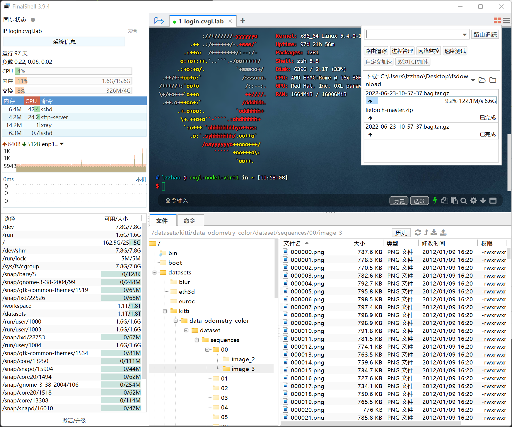
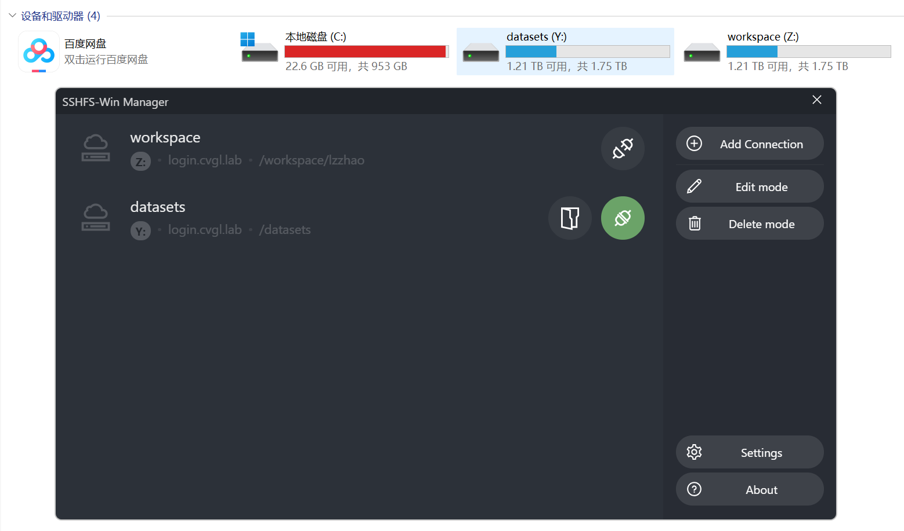
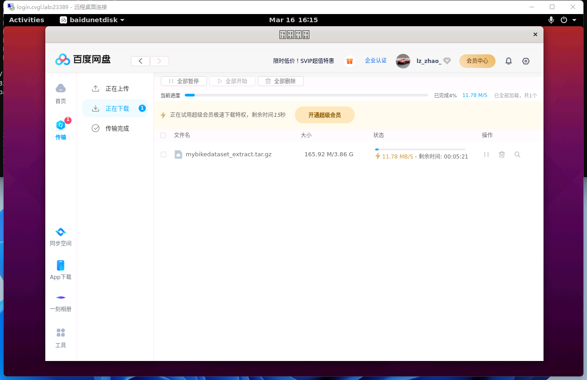
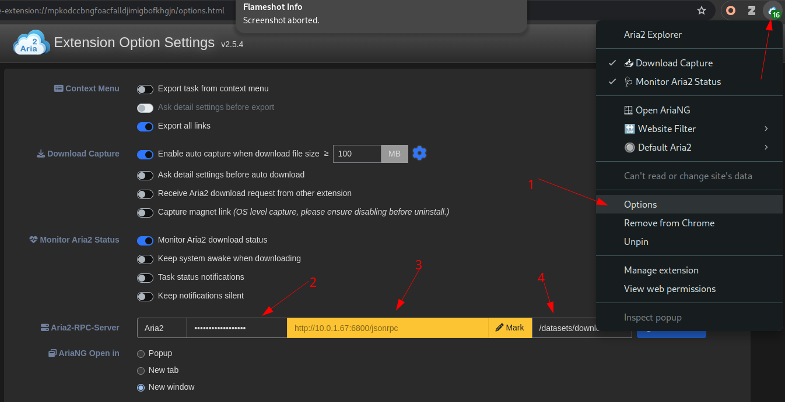
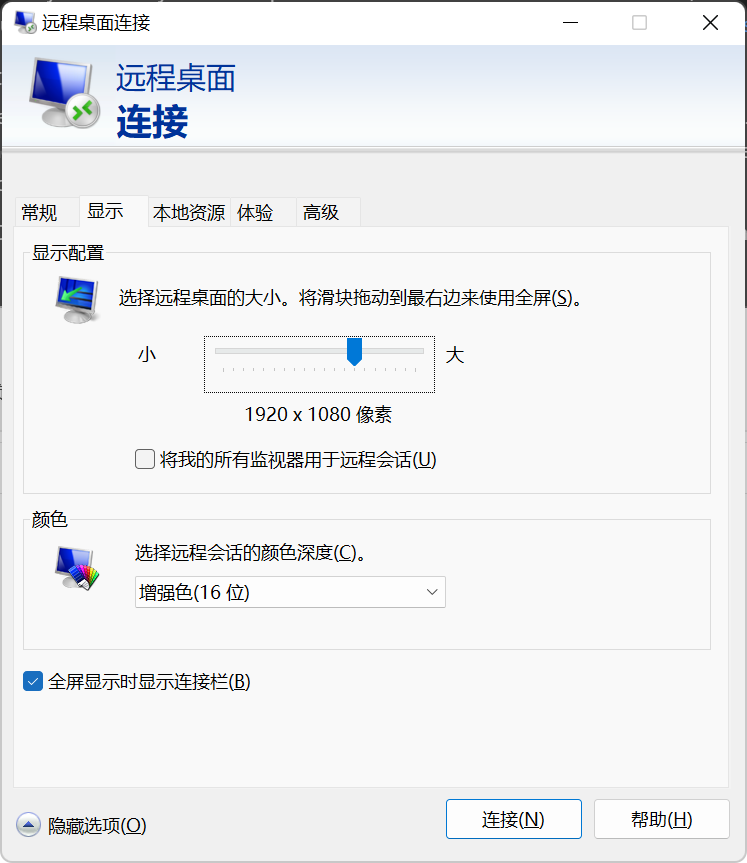

<a id="network-and-remote-access"></a>
# 网络与远程访问

[English](Network_and_Remote_Access.md) | [简体中文](Network_and_Remote_Access.zh.md)

本页汇总可选的传输、下载、代理、GUI 和远程桌面工作流。网络、证书和 SSH 设置请先阅读[入门指南](Getting_started.zh.md)。服务 URL 请参阅[集群参考](Cluster_Reference.zh.md#services)。

<a id="vpn-dns-and-hosts-files"></a>
## VPN、DNS 与 hosts 文件

请使用[入门指南](Getting_started.zh.md#2-connect-to-the-campus-network)中的客户端 hosts 条目和各平台说明。域名失败属于配置或网络问题；关闭 SSH 或 TLS 验证并不能解决它。

<a id="internal-ca-certificates"></a>
## 内部 CA 证书

请遵循 [CA 登记步骤](Getting_started.zh.md#3-enroll-the-cluster-ca-when-required)。浏览器信任 CA 并不会自动配置所有语言运行时或构建工具。[故障排查](Troubleshooting.zh.md)介绍 Python 和 Determined，[容器环境](Custom_Containerized_Environment.zh.md)介绍 Docker 和 Harbor。

<a id="file-transfer-clients"></a>
## 文件传输客户端

对于可重复的大型传输，优先使用基于 `cvgl-login` SSH 别名的 rsync，并遵循[共享存储](Shared_Storage.zh.md)指南。`scp`、SFTP、VS Code Remote SSH、SSHFS、MobaXterm、FinalShell、WinSCP 等客户端可用于小型或交互式传输。请配置非默认 SSH 端口并验证主机密钥。

现有 GUI 示例：

<details>
<summary>FinalShell 文件传输</summary>



</details>

<details>
<summary>Windows 上的 SSHFS</summary>



</details>

<a id="downloads-on-the-cluster"></a>
## 在集群上下载

优先使用权威数据源，并在提供校验和时进行验证。请下载到分配的共享目录，不要占用登录节点的系统盘。`curl`、`wget`、aria2、云服务商 CLI 和特定服务商客户端可能有用，但不保证已经安装。

<details>
<summary>历史服务商客户端示例</summary>



</details>

如果当前提供托管 aria2 服务，请向管理员获取最新端点和认证说明。不要复用截图中的端点、RPC secret 或性能设置。

<details>
<summary>AriaNg 界面示例</summary>





</details>

<a id="proxies-and-mirrors"></a>
## 代理与镜像

代理端点、路由、配额和可用时间可能变化。请向管理员申请当前批准的 HTTP 或 SOCKS 代理，不要把它硬编码进源代码。把代理变量限制在确有需要的命令或 shell 中：

```bash
export HTTP_PROXY=http://PROXY_HOST:PORT
export HTTPS_PROXY=http://PROXY_HOST:PORT
export http_proxy="$HTTP_PROXY"
export https_proxy="$HTTPS_PROXY"
export NO_PROXY=localhost,127.0.0.1,.cvgl.lab
export no_proxy="$NO_PROXY"
```

使用完毕后取消设置：

```bash
unset HTTP_PROXY HTTPS_PROXY http_proxy https_proxy NO_PROXY no_proxy
```

审核本地配置后，可以用 `proxychains-ng` 包装兼容的命令：

```bash
proxychains -q curl https://example.org/
```

部分生态系统通过自身配置支持镜像。只有在镜像得到批准且仍然有效时才使用，并验证下载的制品。不要仅为硬编码代理而修改应用源代码。

<a id="x11-forwarding"></a>
## X11 转发

策略允许时，X11 转发可用于登录节点上的轻量 GUI。Linux 通常提供 X server；Windows 用户可以使用 VcXsrv 或其他仍在维护的 X server；macOS 用户可以使用 XQuartz。

```bash
ssh -X cvgl-login
```

不要在登录节点上运行 GPU 密集型或长时间运行的 GUI 工作负载。请优先使用 Determined shell 和 [Determined AI 用户指南](Determined_AI_User_Guide.zh.md)中支持的 IDE 工作流。

<a id="remote-desktop-through-ssh"></a>
## 通过 SSH 使用远程桌面

远程桌面的可用性、内部端口和桌面环境取决于部署。连接前请先确认。如果 RDP 服务只在登录节点的 loopback 接口上启用，请使用管理员提供并验证的端口建立 SSH 隧道：

```bash
ssh -N -L LOCAL_PORT:localhost:REMOTE_RDP_PORT cvgl-login
```

然后让 RDP 客户端连接 `localhost:LOCAL_PORT`。Windows 自带 RDP 客户端；Linux 客户端包括 Remmina；macOS 可使用 Windows App 或其他仍在维护的 RDP 客户端。

<details>
<summary>历史 Windows RDP 客户端示例</summary>




</details>

该隧道只承载桌面流量。它不会预留计算资源、保持 Determined shell 活跃，也不会让登录节点工作负载因此变得合适。

<a id="related-guides"></a>
## 相关指南

- [入门指南](Getting_started.zh.md)
- [共享存储](Shared_Storage.zh.md)
- [Determined AI 用户指南](Determined_AI_User_Guide.zh.md)
- [自定义容器环境](Custom_Containerized_Environment.zh.md)
- [故障排查](Troubleshooting.zh.md)
