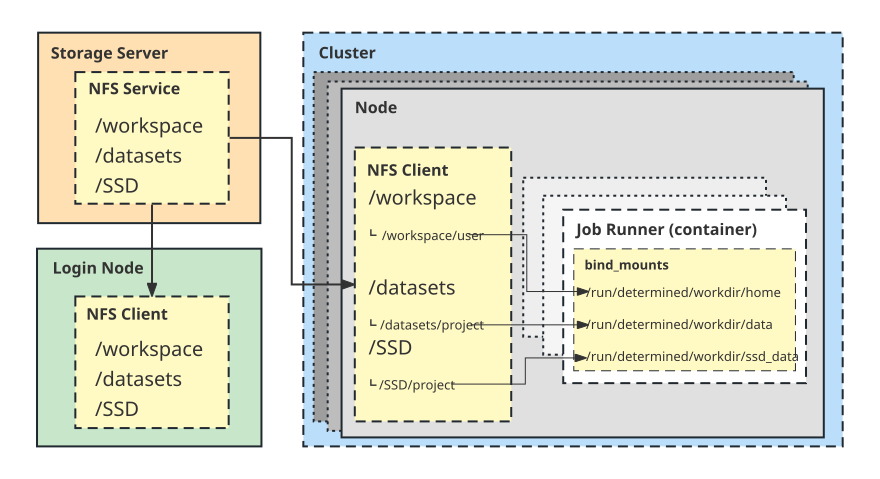

# Shared storage

Cluster jobs should keep code, data, packages, checkpoints, logs, and results on approved shared storage. A personal computer does not need to mount those filesystems: files can be staged through the login node over SSH.



## Storage roots

The cluster exposes these root names. Access, quota, performance, retention, and backup policy can differ by root and may change; confirm the current policy before choosing one.

| Root | Typical role to confirm with the administrator |
| --- | --- |
| `/datasets` | Shared or curated datasets; some areas may be read-only |
| `/workspace` | User or project workspaces, commonly under an assigned subdirectory |
| `/SSD` | SSD-backed storage |
| `/SSD_home` | SSD-backed user or project storage |
| `/SSD_datasets` | SSD-backed dataset storage |
| `/SSD3` | SSD-backed storage |
| `/SSD3_home` | SSD-backed user or project storage |
| `/SSD3_datasets` | SSD-backed dataset storage |
| `/UNSAFE_SSD4` | Storage whose current durability and usage policy must be confirmed explicitly |

A root name does not establish that it is writable, backed up, snapshotted, permanent, or suitable for the only copy of valuable data. Keep an independent copy when the documented retention or backup policy does not meet your needs.

## Three path namespaces

Do not mix these namespaces:

| Namespace | Meaning |
| --- | --- |
| Cluster host path | The path visible on the login node or a Determined agent, such as `/workspace/USER/project` |
| Container path | The absolute path declared by `bind_mounts[].container_path` and used by the workload |
| Client local path | A path on your laptop or workstation; it may not resemble either cluster path |

A bind mount defines the translation explicitly:

```yaml
bind_mounts:
  - host_path: /workspace/USER
    container_path: /run/determined/workdir/home
  - host_path: /datasets
    container_path: /datasets
    read_only: true
  - host_path: /SSD3_home
    container_path: /SSD3_home
```

Inside the container, use the declared `container_path`. It is an absolute path and does not need to be beneath `/run/determined/workdir` or the task's current working directory. The exact mappings in the submitted configuration are authoritative.

## Permissions and read-only data

Before a long run, check the actual directory and its parents from the login node:

```bash
ssh cvgl-login 'id; ls -ld /workspace/USER /datasets'
```

Do not assume a readable dataset is writable. Change permissions only on directories you manage. Use an assigned writable directory or project group instead of broad modes such as `chmod -R 777`.

Some NFS/NAS exports reject owner, group, permission, or directory-time preservation. A failed rsync may return exit code 23 after copying some files. Inspect the output and correct the cause before rerunning. If the filesystem policy requires it, use `--no-owner --no-group --no-perms --omit-dir-times` for that destination only; do not make those flags a blind global default.

## Stage files through the login node

Use the SSH alias from [Getting started](Getting_started.md#5-configure-a-stable-ssh-alias). Preview first and avoid `--delete` unless you have deliberately reviewed the destination:

```bash
rsync -a --safe-links --itemize-changes --dry-run \
  --exclude='.git/' --exclude='.env*' --exclude='.secrets*' \
  --exclude='.ssh/' --exclude='.aws/' --exclude='*.pem' --exclude='*.key' \
  "$PWD/project/" cvgl-login:/workspace/USER/project/

rsync -a --safe-links --itemize-changes \
  --exclude='.git/' --exclude='.env*' --exclude='.secrets*' \
  --exclude='.ssh/' --exclude='.aws/' --exclude='*.pem' --exclude='*.key' \
  "$PWD/project/" cvgl-login:/workspace/USER/project/
```

The trailing slash copies directory contents. Even without `--delete`, rsync can replace same-named destination files. The exclusions are a starting point, not a complete secret scanner: review project-specific credentials, caches and machine-local state before transferring. Do not place passwords or tokens in commands, task configuration, logs, or reports.

Fetch results in the reverse direction:

```bash
mkdir -p "$PWD/results"
rsync -a --safe-links --itemize-changes --dry-run \
  cvgl-login:/workspace/USER/run/results/ "$PWD/results/"
```

Remove `--dry-run` only after reviewing the itemized changes. GUI SFTP clients may be useful for small transfers; see [Network and remote access](Network_and_Remote_Access.md#file-transfer-clients).

## Use shared paths in Determined

Before launch, place source, configuration, data and locally supplied packages on shared storage, and choose shared paths for checkpoints, logs and outputs. Runtime dependencies can also be installed in the container image. A durable run should use a stable revision-specific directory; an interactive debugging shell may use a mutable workspace.

Reference these paths with `bind_mounts`, the task command, and the appropriate checkpoint/output settings. Do not upload code or data through an experiment `modelDefinition`, project archive, file context, or project-root option. Shared storage is the transfer and persistence boundary.

See [Determined AI user guide](Determined_AI_User_Guide.md) for task configuration and [Custom containerized environments](Custom_Containerized_Environment.md) for images and dependencies.

## Before relying on a storage root

Confirm all of the following with the current documentation or administrator:

- your assigned writable path and group;
- quota and expected file-count limits;
- whether the path is available on the required Determined resource pool;
- backup, snapshot, retention, and deletion policy;
- whether high-I/O workloads are appropriate there;
- where durable results should be copied after the run.

If any of these are unknown, do not infer an answer from the filesystem name or an old example.
