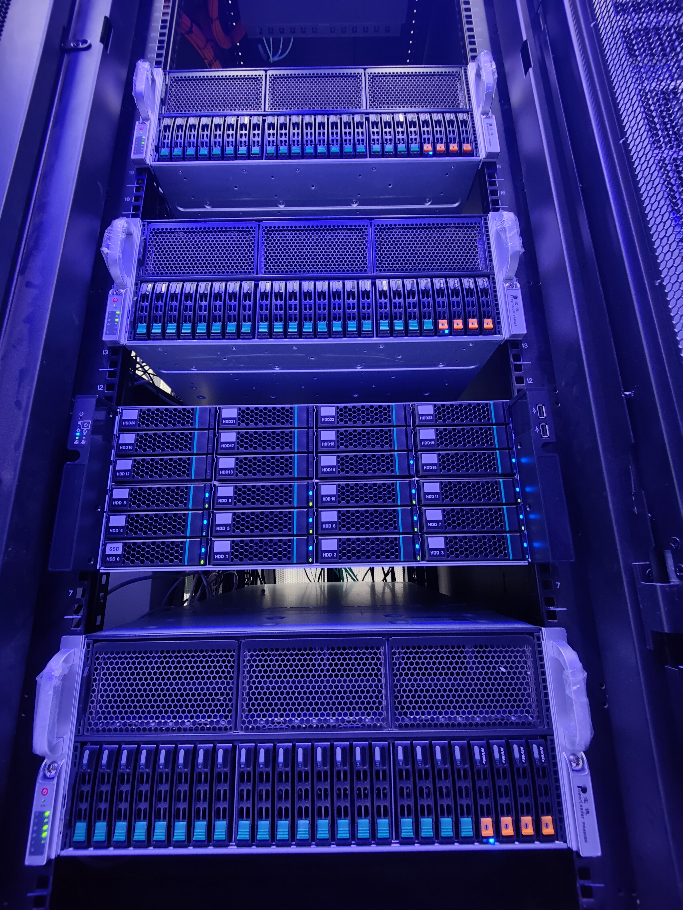
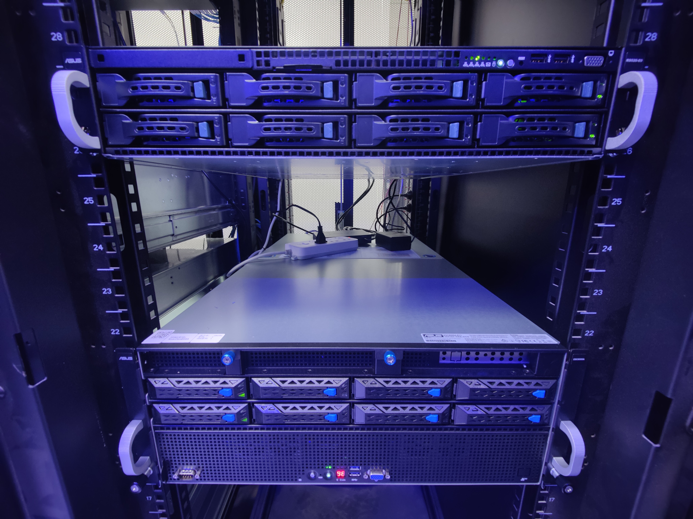
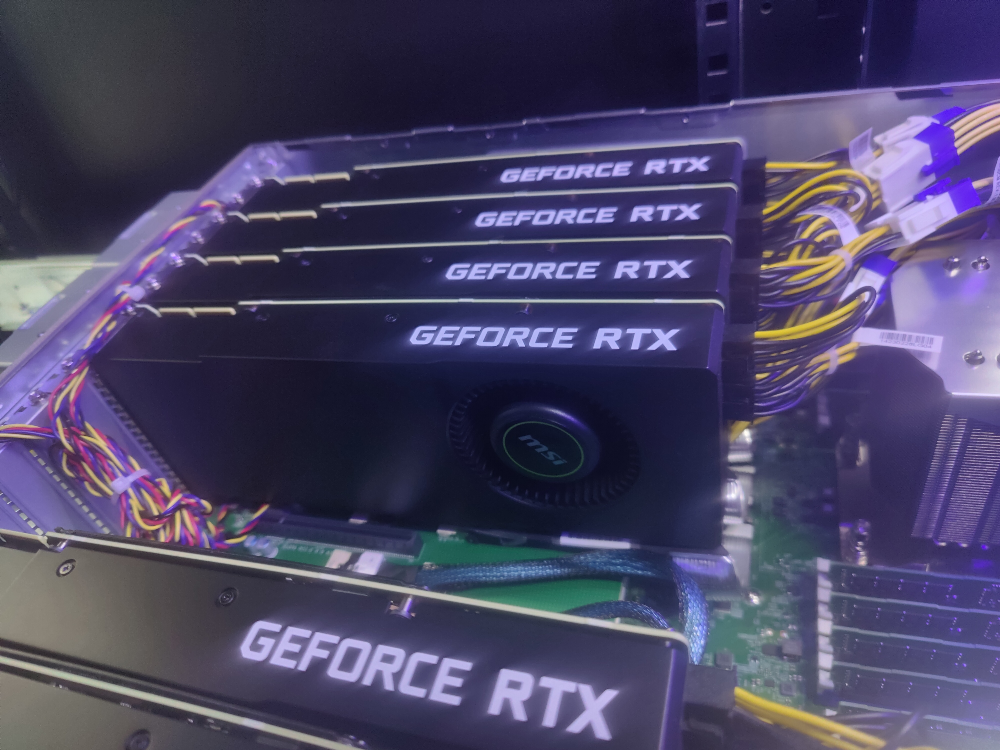
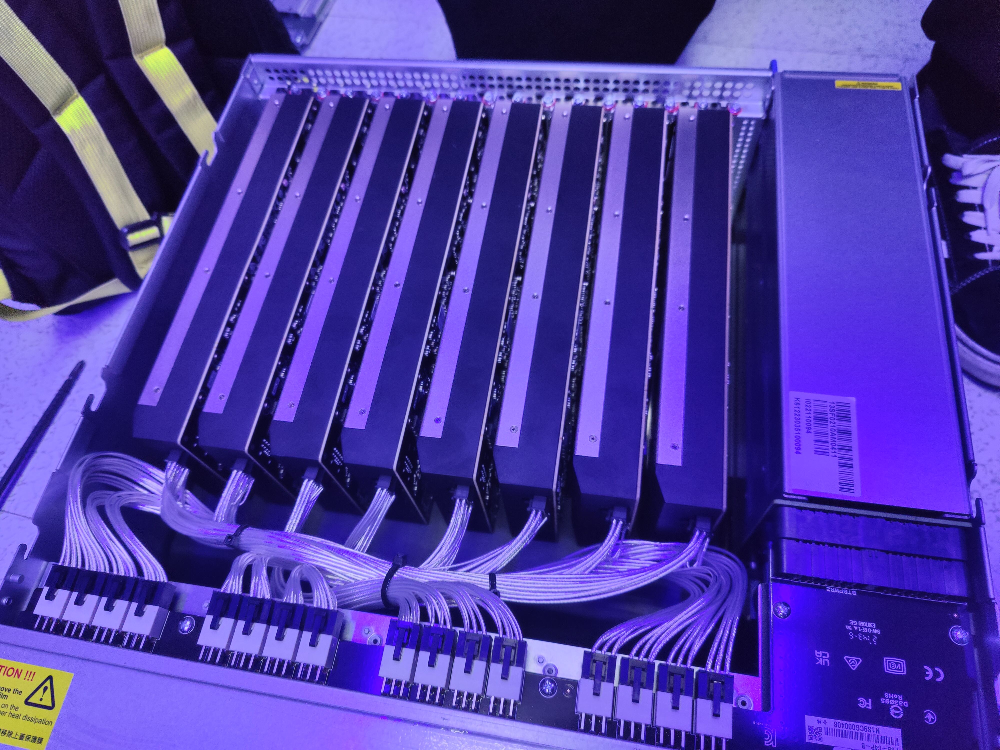
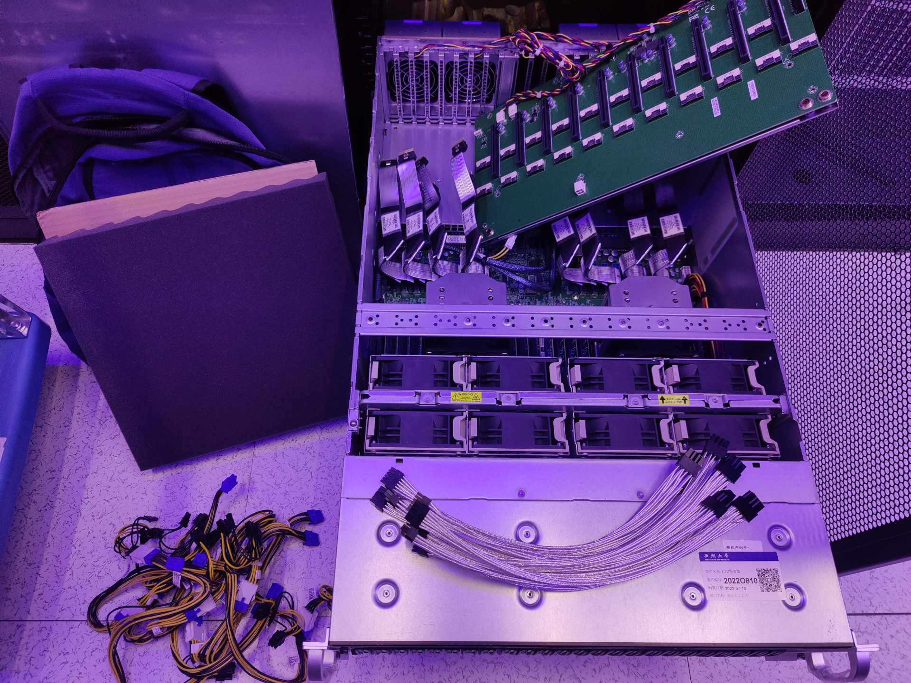

# 硬件清单

[English](Hardware_Inventory.md) | [简体中文](Hardware_Inventory.zh.md)

[首页](../README.zh.md) · [集群参考](Cluster_Reference.zh.md)

本硬件记录由原始指南迁移而来。它是已安装设备的参考记录，并不是健康或可用资源的实时数量。选择资源池或启动任务前，请查询 Determined。

集群节点的具体配置如下：

## GPU 节点 1

| 名称 | 规格 |
| :----: | :---- |
| 型号 | Powerleader PR4908R (Supermicro 4124GS-TNR) |
| CPU | AMD EPYC 7302 * 2 (32C/64T, 3.0-3.3GHz) |
| 内存 | Samsung M393A2K43DB2-CVF DDR4 256G (16G*16) 2933MT/s ECC REG |
| GPU | MSI (0x1462) RTX 3090 Turbo * 8 |
| SSD | Intel P4510 2TB (U.2 PCIe 3.1) * 1 |
| 网卡 | Intel I350-T2 1GbE 双端口 |
| 网卡 | Mellanox ConnectX-4 VPI EDR QSFP28 MCX455A-ECAT 100Gb ETH/IB 单端口 |
| RAID | LSI MegaRAID SAS-3 3108 |

## GPU 节点 2

| 名称 | 规格 |
| :----: | :---- |
| 型号 | Powerleader PR4908R (Supermicro 4124GS-TNR) |
| CPU | AMD EPYC 7402 * 2 (48C/96T, 2.8-3.35GHz) |
| 内存 | SK Hynix HMA84GR7DJR4N-XN DDR4 512G (32G*16) 3200MT/s ECC REG |
| GPU | MANLI (NVIDIA/0x10DE) RTX 4090 * 8 |
| SSD | Intel P4510 2TB (U.2 PCIe 3.1) * 1 |
| SSD | Kioxa CD6 7.68TB (U.2 PCIe 4.0) * 1 |
| 网卡 | Intel I350-T2 1GbE 双端口 |
| 网卡 | Mellanox ConnectX-4 VPI EDR QSFP28 MCX455A-ECAT 100Gb ETH/IB 单端口 |

## GPU 节点 3、4

| 名称 | 规格 |
| :----: | :---- |
| 型号 | Powerleader PR4908R (Supermicro 4124GS-TNR) |
| CPU | AMD EPYC 7402 * 2 (48C/96T, 2.8-3.35GHz) |
| 内存 | Samsung M393A4K40DB3-CWE DDR4 512G (32G*16) 3200MT/s ECC REG |
| GPU | MSI (0x1462) RTX 3090 * 8 |
| SSD | Intel P4510 2TB (U.2 PCIe 3.1) * 1 |
| 网卡 | Intel I350-T2 1GbE 双端口 |
| 网卡 | Mellanox ConnectX-4 VPI EDR QSFP28 MCX455A-ECAT 100Gb ETH/IB 单端口 |

## GPU 节点 5

| 名称 | 规格 |
| :----: | :---- |
| 型号 | ASUS ESC8000A-E11 |
| CPU | AMD EPYC 7543 * 2 (64C/128T, 2.8-3.7GHz) |
| 内存 | Samsung M393A4K40EB3-CWE DDR4 512G (32G*16) 3200MT/s ECC REG |
| GPU | MANLI (NVIDIA/0x10DE) RTX 4090 * 8 |
| SSD | Intel S4610 (SSDSC2KG96) 960G (SATA) (RAID 1) * 2 |
| 网卡 | Intel I350-T4 1GbE 四端口 |
| 网卡 | Mellanox ConnectX-4 VPI EDR QSFP28 MCX455A-ECAT 100Gb ETH/IB 单端口 |
| RAID | LSI SAS3008 PCI-Express Fusion-MPT SAS-3 |

## GPU 节点 6、7

| 名称 | 规格 |
| :----: | :---- |
| 型号 | ASUS ESC8000A-E12 |
| CPU | AMD EPYC 9554 * 2 (128C/256T, 3.1-3.75GHz) |
| 内存 | Samsung M321R8GA0BB0-CQKZJ / Micron MTC40F2046S1RC48BA1 DDR5 1536G (64G*24) 4800MT/s ECC REG |
| GPU | MSI (NVIDIA/0x10DE) RTX 4090 * 8 |
| SSD | Samsung PM9A3 1.92T (U.2 PCIe 4.0) * 1 |
| 网卡 | Intel I350-AM2 1GbE 双端口 |
| 网卡 | Mellanox ConnectX-4 VPI EDR QSFP28 MCX455A-ECAT 100Gb ETH/IB 单端口 |

## GPU 节点 8

| 名称 | 规格 |
| :----: | :---- |
| 型号 | ASUS ESC8000A-E12 |
| CPU | AMD EPYC 9554 * 2 (128C/256T, 3.1-3.75GHz) |
| 内存 | SK Hynix HMCG94AEBRA109N DDR5 1536G (64G*24) 4800MT/s ECC REG |
| GPU | NVIDIA (0x10de) RTX 6000 Ada Generation 48G * 8 |
| SSD | Samsung PM9A3 (MZQL21T9HCJR-00A07) 1.92TB 2.5" NVMe U.2 硬盘 * 2 |
| 网卡 | Mellanox ConnectX-6 VPI 网卡；HDR100、EDR IB/100GbE；双端口 QSFP56；PCIe4.0 x16；(MCX653106A-ECAT) |
| 网卡 | Intel I350-T2 1GbE 双端口 |

## 存储服务器

| 名称 | 规格 |
| :----: | :---- |
| 型号 | Powerleader PR4224AK (Supermicro H11SSL) |
| CPU | AMD EPYC 7302 (16C/32T, 3.0-3.3GHz) |
| 内存 | Samsung M393A4K40DB2-CWE DDR4 256G (32G*8) 2933MT/s ECC REG |
| SSD | INTEL 760p (SSDPEKKW256G8) 256G (M.2 PCIe 3.0) * 1 |
| SSD | Intel S4510 1.92TB (SATA) * 2 |
| SSD | WD Ultrastar DC SN640 (WUS4BB076D7P3E3) 7.68TB (U.2 PCIe 3.0) * 12 |
| HDD | Seagate Exos X18 18TB * 24 |
| 网卡 | Intel i210 1GbE * 2 |
| 网卡 | Mellanox ConnectX-4 VPI EDR QSFP28 MCX455A-ECAT 100Gb ETH/IB 单端口 |
| RAID | LSI SAS3008 PCI-Express Fusion-MPT SAS-3 |

## 存储服务器（2U，仅 SSD）

| 名称 | 规格 |
| :----: | :---- |
| 型号 | Dell PowerEdge R7525 |
| CPU | AMD EPYC 7313 * 2  (32C/64T, 3.0-3.7GHz) |
| 内存 | Samsung DDR4 ECC REG 3200MHz 512G (32G * 16) |
| SSD | KIOXIA DC CD7 RI 960GB 2.5" NVMe U.2 硬盘 |
| 网卡 | Broadcom BCM5720 千兆以太网 * 2 |
| 网卡 | Mellanox ConnectX-6 VPI 网卡；HDR100、EDR IB/100GbE；双端口 QSFP56；PCIe4.0 x16；(MCX653106A-ECAT) |

## 管理服务器

| 名称 | 规格 |
| :----: | :---- |
| 型号 | ASUS RS520-E9-RS8 V2 |
| CPU | Intel Xeon Silver 4210R * 2 (20C/40T, 2.4-3.2GHz) |
| 内存 | Samsung M393A4K40EB3-CWE DDR4 64G (32G*2) 3200MT/s @ 2400MT/s ECC REG |
| SSD | Intel S4610 (SSDSC2KG96) 960G * 2 (SATA) (RAID 1) |
| 网卡 | Intel i350-AM2 1GbE 双端口 |
| 网卡 | Mellanox ConnectX-4 VPI EDR QSFP28 MCX455A-ECAT 100Gb ETH/IB 单端口 |
| RAID | LSI SAS3008 PCI-Express Fusion-MPT SAS-3 |

## 交换机

| 品牌 | 型号与规格 |
| :----: | :---- |
| NVIDIA Mellanox | Spectrum SN2700 100GbE 1U 开放式以太网交换机，搭载 NVIDIA Onyx，32 个 QSFP28 端口，2 个 PSU，x86 CPU，标准深度 |

点击显示照片

