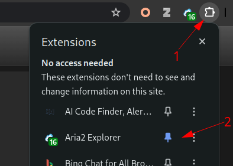
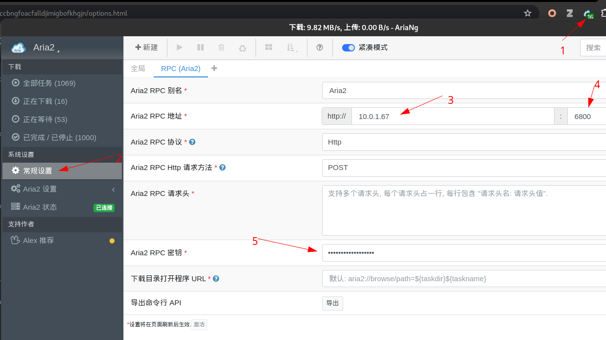
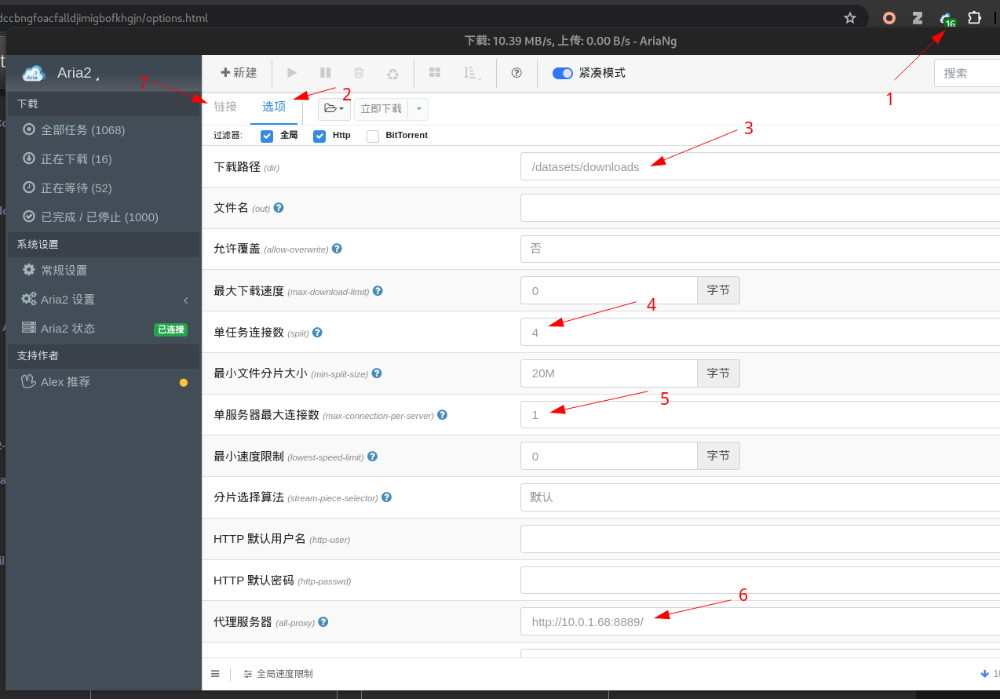

# Network and remote access

[English](Network_and_Remote_Access.md) | [简体中文](Network_and_Remote_Access.zh.md)

This page collects optional transfer, download, proxy, GUI, and remote-desktop workflows. Start with [Getting started](Getting_started.md) for the network, certificates and SSH setup. See [Cluster reference](Cluster_Reference.md#services) for service URLs.

## VPN, DNS, and hosts files

Use the client-side hosts entries and platform instructions in [Getting started](Getting_started.md#2-connect-to-the-campus-network). A hostname failure is a configuration or network issue; disabling SSH or TLS verification does not fix it.

## Internal CA certificates

The login node is already configured. On a personal computer, use the single [CA enrollment procedure](Getting_started.md#3-enroll-the-cluster-ca-when-required). Configure a separate CA store only for software that does not use the system trust store. SSH host keys are unrelated to the HTTPS CA.

## File-transfer clients

For repeatable large transfers, prefer rsync over the `cvgl-login` SSH alias and follow [Shared storage](Shared_Storage.md). `scp`, SFTP, VS Code Remote SSH, SSHFS, MobaXterm, FinalShell, WinSCP, and similar clients can help with small or interactive transfers. Configure the non-default SSH port and verify the host key.

Existing GUI examples:

<details>
<summary>FinalShell file transfer</summary>


</details>

<details>
<summary>SSHFS on Windows</summary>


</details>

## Downloads on the cluster

Prefer authoritative dataset sources and verify checksums when provided. Download into an assigned shared directory rather than the login node's system disk. Tools such as `curl`, `wget`, aria2, cloud-provider CLIs, and provider-specific clients may be useful; availability is not guaranteed.

<details>
<summary>Provider-client screenshot</summary>


</details>

If a managed aria2 service is currently offered, obtain its current endpoint and authentication instructions from the administrator. Do not reuse endpoints, RPC secrets, or performance settings from screenshots.

<details>
<summary>AriaNg interface examples</summary>








</details>

## Proxies and mirrors

Proxy endpoints, routes, quotas, and uptime change. Request a currently approved HTTP or SOCKS proxy from the administrator and avoid embedding it in source code. Scope proxy variables to the command or shell that needs them:

```bash
export HTTP_PROXY=http://PROXY_HOST:PORT
export HTTPS_PROXY=http://PROXY_HOST:PORT
export http_proxy="$HTTP_PROXY"
export https_proxy="$HTTPS_PROXY"
export NO_PROXY=localhost,127.0.0.1,.cvgl.lab
export no_proxy="$NO_PROXY"
```

Unset them when finished:

```bash
unset HTTP_PROXY HTTPS_PROXY http_proxy https_proxy NO_PROXY no_proxy
```

`proxychains-ng` can wrap compatible commands after its local configuration has been reviewed:

```bash
proxychains -q curl https://example.org/
```

Some ecosystems support mirrors through their own configuration. Use a mirror only when it is approved and current, and verify downloaded artifacts. Avoid modifying application source merely to hard-code a proxy.

## X11 forwarding

X11 forwarding may be useful for a lightweight GUI on the login node when policy permits it. Linux commonly provides an X server; Windows users can use VcXsrv or another maintained X server; macOS users can use XQuartz.

```bash
ssh -X cvgl-login
```

Do not use the login node for GPU-heavy or long-running GUI workloads. Prefer a Determined shell and the supported IDE workflow described in [Determined AI user guide](Determined_AI_User_Guide.md).

## Remote desktop through SSH

Remote desktop availability, internal port, and desktop environment are deployment-specific. Confirm them before connecting. When an RDP service is enabled only on the login node's loopback interface, create an SSH tunnel using the current port supplied by the administrator:

```bash
ssh -N -L LOCAL_PORT:localhost:REMOTE_RDP_PORT cvgl-login
```

Then point the RDP client at `localhost:LOCAL_PORT`. Windows includes an RDP client; Linux clients include Remmina; macOS clients include Windows App or another maintained RDP client.

<details>
<summary>Windows RDP client screenshots</summary>


</details>

The tunnel carries desktop traffic only. It does not reserve compute resources, keep a Determined shell active, or make a login-node workload appropriate.

## Related guides

- [Getting started](Getting_started.md)
- [Shared storage](Shared_Storage.md)
- [Determined AI user guide](Determined_AI_User_Guide.md)
- [Custom containerized environments](Custom_Containerized_Environment.md)
- [Troubleshooting](Troubleshooting.md)
